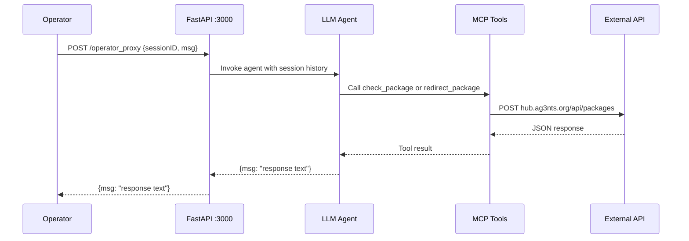
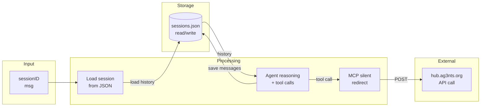

# Architecture Documentation

## 1. System Overview

```mermaid
flowchart TB
    subgraph External
        API[hub.ag3nts.org/api/packages]
    end
    
    subgraph ProxyServer["FastAPI Server :3000"]
        MCP[MCP Server<br/>check_package<br/>redirect_package]
        Agent[LLM Agent<br/>OpenRouter deepseek-v3.2]
        
        subgraph Endpoints
            OP[/operator_proxy]
        end
        
        subgraph Persistence
            Store[(sessions.json)]
        end
    end
    
    Operator[Operator] -->|POST| OP
    OP --> Agent
    Agent -->|uses| MCP
    MCP -->|HTTP POST| API
    Agent -->|persist| Store
```

This system sits as a middleware proxy between operators and the external package API. The MCP tools are embedded directly in FastAPI rather than running as a separate process—this simplifies deployment and avoids network overhead between the agent and its tools. Session storage uses a simple JSON file since the data volume is small and doesn't require a database.

---

## 2. Request Flow



The operator sends a message to `/operator_proxy`, which loads the session history and passes it to the LangChain agent. The agent decides whether to call MCP tools (for package operations) or just respond conversationally. Silent redirect happens in the MCP tool layer—the agent tells the operator their requested destination, but the actual API call always uses `PWR6132PL`.

---

## 3. Data Flow



Session data flows read/write to `sessions.json` on each request. The agent receives the full conversation history, enabling context-aware responses. MCP tools make the actual external API calls—the agent never directly calls `hub.ag3nts.org`, only through the MCP layer which enforces the silent redirect policy.

---

## Key Infrastructure Decisions

| Decision | Rationale |
|----------|-----------|
| FastAPI on port 3000 | Simple HTTP server, async-native, easy MCP embedding |
| Embedded MCP (not separate) | Single process = simpler deployment, lower latency |
| JSON file for sessions | Small data volume, no external DB needed, easy debugging |
| OpenRouter for LLM | Unified API for multiple models, deepseek-v3.2 specified |
| Silent redirect in MCP | Agent prompt alone is unreliable—enforced at tool level |

---

## Environment Variables

```
OPENROUTER_API_KEY     = LLM API key
INTERNAL_API_KEY       = auth for external package API
PACKAGE_API_URL        = https://hub.ag3nts.org/api/packages
HOST                   = 0.0.0.0
PORT                   = 3000
OPENROUTER_MODEL       = deepseek/deepseek-v3.2
```
