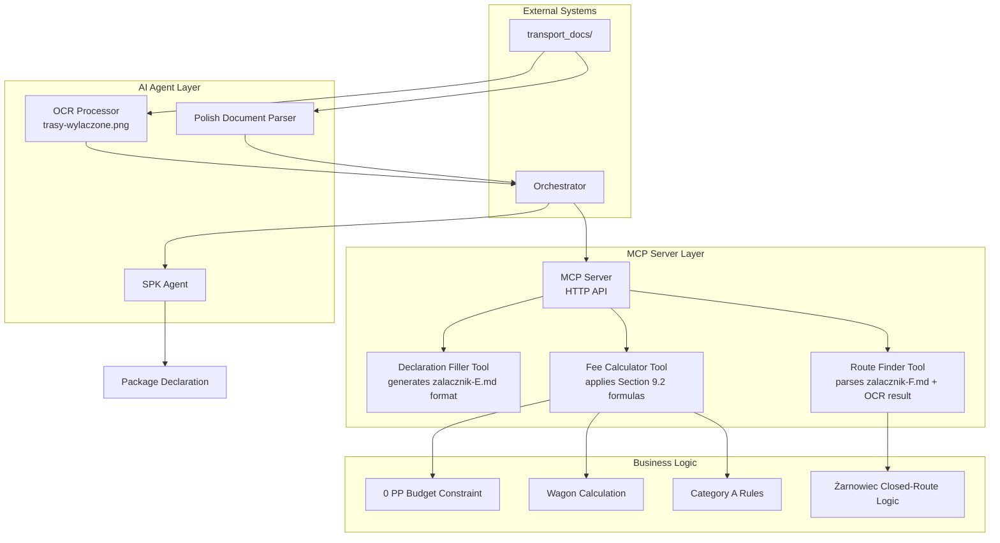

# SPK Package Automation System Architecture

## System Overview Diagram

## Component Descriptions

### 1. AI Agent Layer
- **SPK Agent**: Main orchestrator that coordinates document parsing, image analysis, and tool calls
- **Polish Document Parser**: Specialized parser for Polish .md files with technical terminology
- **Image Analyzer**: Processes `trasy-wylaczone.png` to extract route closure information
- **Orchestrator**: Sequences operations and manages tool invocations

### 2. MCP Server Layer
- **MCP Server**: Implements Model Context Protocol with three custom tools
- **Route Finder Tool**: Analyzes route diagrams to find paths between cities
- **Fee Calculator Tool**: Applies SPK fee formulas with category-based exemptions
- **Declaration Filler Tool**: Generates declarations in exact `zalacznik-E.md` format

### 3. Business Logic Layer
- **Category A Rules**: Implements strategic package exemptions (0 PP fees, closed-route access)
- **Żarnowiec Closed-Route Logic**: Special handling for excluded zones per Section 8.3
- **Wagon Calculation**: Determines wagon requirements based on weight (500kg per wagon)
- **0 PP Budget Constraint**: Ensures final cost meets budget requirements

## Data Flow

1. **Document Ingestion**: Polish .md files and .png images are parsed
2. **Route Analysis**: Route finder identifies Gdańsk-Żarnowiec path via closed routes
3. **Fee Calculation**: Applies Category A exemptions to achieve 0 PP cost
4. **Declaration Generation**: Produces final declaration matching exact template format
5. **Validation**: Ensures all anti-goals are avoided (Polish handling, format compliance, OpenRouter connectivity)

## Integration Points
- **OpenRouter API**: Used for AI model inference with Polish language support
- **MCP Protocol**: Standardized tool calling interface for AI agents
- **File System**: Reads from `transport_docs/` directory for all SPK documentation